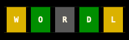
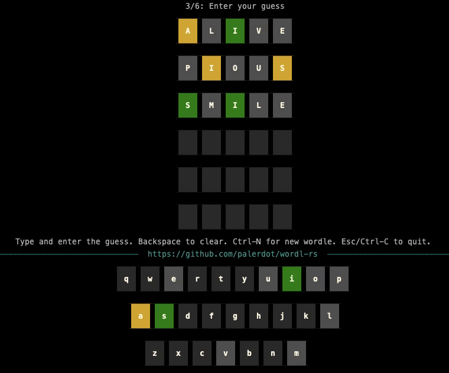

# wordl-rs

`Terminal wordle`. Web like terminal wordle game with keyboard hints, slow reveal animations etc.

<p align="center">
  
</p>


> Terminal Wordle.

**WORDL** aims to provide web like `Wordle` experience in the terminal, mainly
- `Slow Reveal` letter colors after guessing.
- Keyboard Hints



### Installation

Install from [Cargo](https://doc.rust-lang.org/cargo/getting-started/installation.html).

```
cargo install wordl
```

Precompiled binaries are available in [Latest Releases page](https://github.com/palerdot/wordl-rs/releases/latest). Please note, the precompiled binaries are **not signed**. For example, in `MacOS`, you have to manually allow running the binary in `Security & Privacy` settings.

### About

Rules are pretty simple.
- Type your guess and press `enter`. Press `Backspace` to clear already typed letter.
- Press `Ctrl-N` to start a new wordle guess. Please note, this only works if the game is over. i.e. You have guessed correctly or you ran out of 6 attempts. 
- Press `Esc` or `Ctrl-C` to exit the game.

If the terminal window is too small, keyboard hints are not shown. Please make sure your terminal has minimum required height for the keyboard hints to be shown.

`wordl-rs` is built with [Rust Ratatui library](https://github.com/ratatui-org/ratatui).

#### Wordle Words list

Data for Wordle words are present as `.txt` files in [`/files`](./src/wordle/files) directory. The data was initially seeded from [here](https://gist.github.com/cfreshman/a7b776506c73284511034e63af1017ee) and [here](https://gist.github.com/cfreshman/d5fb56316158a1575898bba1eed3b5da). Right now, wordle words list is not synced. If you want any words to be added or removed, please submit a PR.


